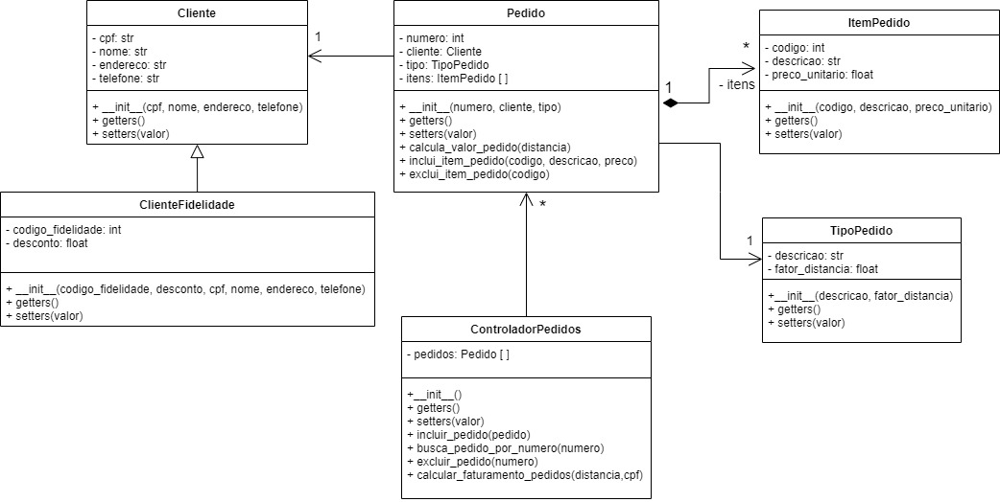

# Delivery Management System

This project was developed for my Object-Oriented Systems Development course. It's a Python-based application that simulates the backend logic for a delivery service, built to adhere to a specific UML class diagram.

The system's core function is to manage clients and their orders. It calculates the final price of an order by considering all its items, the delivery distance, and applying special conditions such as different costs for fragile items or discounts for loyalty program members.

### Technical Highlights & OOP Concepts

Building this system was a practical exercise in applying core object-oriented principles to solve a defined problem.

* **Inheritance** was used to create a `ClienteFidelidade` (Loyalty Client) that extends the base `Cliente` class. This allows for specialized discount logic without duplicating code, showcasing a clear "is-a" relationship.

* The relationship between an `Pedido` (Order) and its `ItemPedido` (Order Items) was modeled with **Composition**, ensuring that items are an integral part of an order.

* **Encapsulation** is enforced throughout the project, with private attributes accessed and modified through Python's `@property` for getters and setters, ensuring data integrity.

* The main `ControladorPedidos` (Orders Controller) uses **Aggregation** to manage a list of `Pedido` objects, which can exist independently of the controller.

This class-based structure makes the system modular, reusable, and easier to maintain.

### UML Class Diagram

The system's architecture is based on the following UML diagram:



### Running the Project

To see the system in action, you can run the demonstration script. This requires Python 3.

```bash
# First, clone the repository to your machine
git clone [https://github.com/your-username/your-repository-name.git](https://github.com/your-username/your-repository-name.git)

# Navigate into the project directory
cd your-repository-name

# Run the main script
python main.py
```

---

A project by **Cecília Zica Camargo** | www.linkedin.com/in/cecilia-zica-camargo | zicacamargocecilia@gmail.com